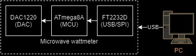

# Job-projects
### Description

This repository contains some of my work as an engineer in [Russian Scientific Research Institute](https://www.vniiftri.ru/). My primary goal is to design a measuring device - **microwave wattmeter**.
 
 [**Microwave wattmeter**](https://drive.google.com/file/d/1DkEJPY_jXihFlMOo3NosO_gAjYZUhH1n/view?usp=sharing)
 It is a device which measure power of RF signal passing across waveguide to load.
 
 
 * 1. *Converter*. 
 This consist of waveguide and sensor. Sensor is nothing but a thermistor, which located in waveguide. When measured signal passing through termistor the electromagnetic energy is converting to heat. This leads to  resistance changing of thermistor. 
  * 2. *Measurment unit*. 
 Its job is to calculate electromagnetic power according to the state of sensor.
 ### Submodules
 *Wattmeter-DAC
 Atmel Studio project for ATmega8A MCU. MCU getting commands from user's desktop program via FTDI FT2232 usb/spi bridge IC.
 
 
